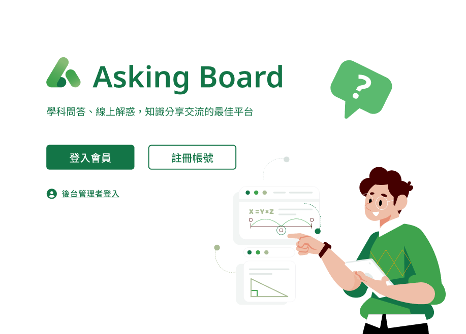
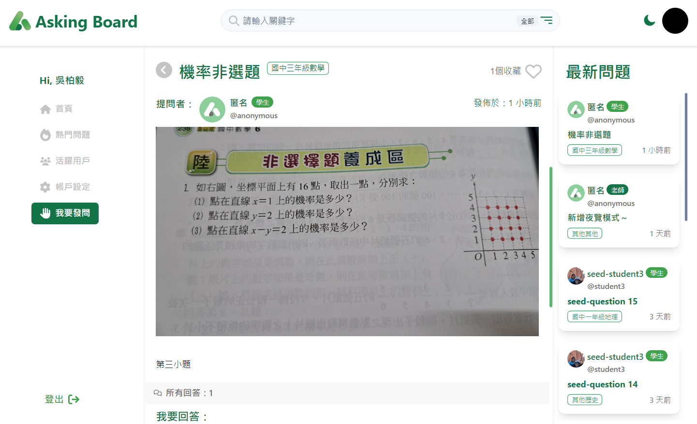

# Asking Board API
* Asking Board 是提供給國中學生的課業問答平臺，使用者可以在平台上進行課業交流並與其他使用者互動。
* 專案的開發方式為前後分離，此 Repo 為後端的 Web API
* [API文件](https://askingboard.docs.apiary.io/#)
* [網站入口](https://peggy8422.github.io/asking-board/)


<br />

## 功能簡介

### 一般使用者
* 註冊、登入(一般登入或 google登入)、登出
* 問題相關
  * 瀏覽所有問題
  * 關鍵字搜尋
  * 發問 / 匿名發問
  * 可上傳圖片
  * 編輯自己的發問
  * 收藏 / 取消收藏問題
  * 查看特定問題下的回覆
  * 回覆問題
  * 對回覆按讚 / 收回讚
* 使用者互動
  * 查看使用者的
    * 發問
    * 回覆
    * 收藏的問題
    * 追蹤者及追隨者
  * 追蹤 / 取消追蹤其他使用者
  * 查看活躍用戶
  * 修改個人資料及帳號資料

### 後台管理者
* 後臺登入
* 瀏覽全站問題
* 刪除問題
* 查看使用者活動記錄，包含：
  * 發問數
  * 回覆數
  * 追蹤者及追隨者人數
  * 發問被收藏及回覆收到讚數

### 測試帳號
亦歡迎註冊帳號給予指導

| 身分 | 帳號 | 密碼 |
| - | - | - |
| 一般使用者 | student1@example.com | password |
| 後台管理者 | root@example.com | password |

<br />

## 本地安裝
1. Clone 此專案至本機電腦，打開 terminal 至欲存放專案之資料夾，輸入：
```
git clone https://github.com/HowardWu5566/asking-board
```
2. 進入專案資料夾，請在終端機輸入：
```
cd asking-board
```
3. 安裝 npm 套件，請在終端機輸入：
```
npm install
```
4. 依據 .env.example 建立 .env 檔案
<br>

5. 到 MySQL Workbench 建立專案資料庫  
```
create database asking_board_development;
```
6. 在資料庫建立 tables，請在終端機輸入：
```
npx sequelize db:migrate
```
7. 建立種子資料：
```
npx sequelize db:seed:all
```
8. 啟動專案，請在終端機輸入：
```
npm run dev
```
9. 輸入下列代碼於**網址列**即可使用
```
localhost:3000
```
10. 要停止專案請在終端機按 Ctrl+C
<br />

## 開發者
後端
Howard Wu <br>
前端
[Peggy](https://github.com/Peggy8422) <br>